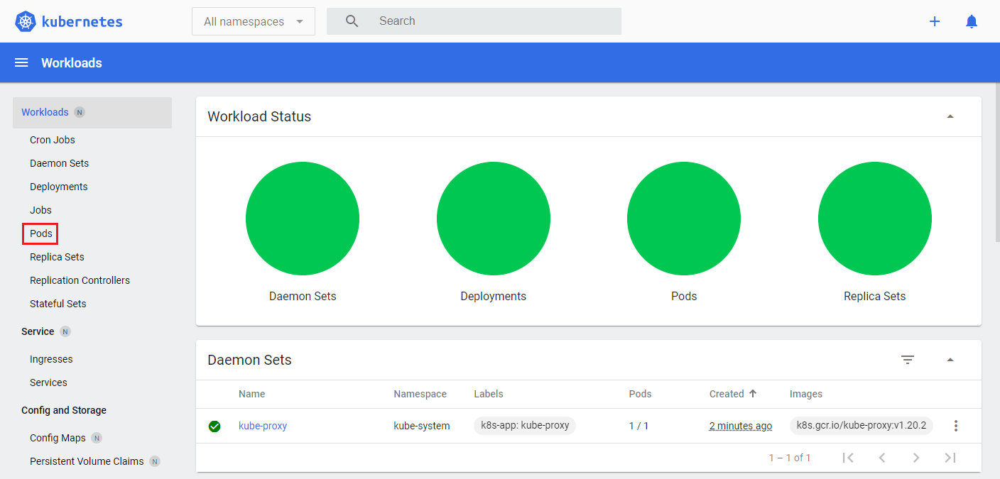
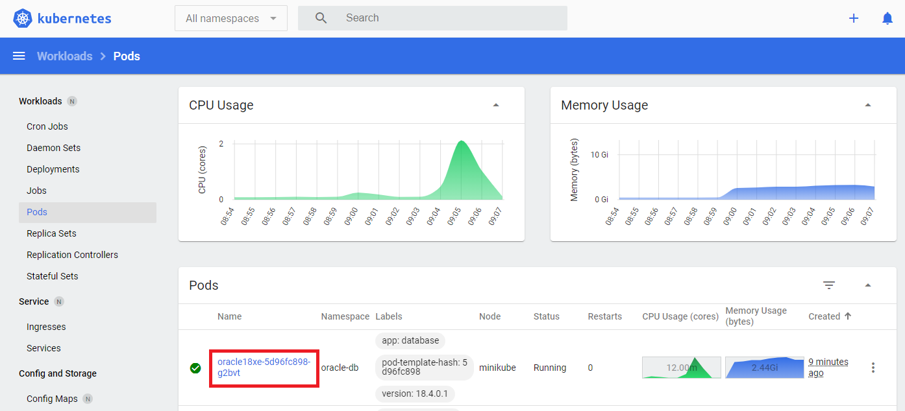
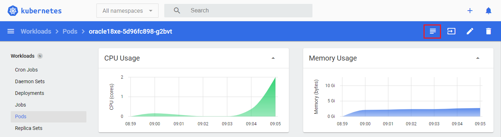
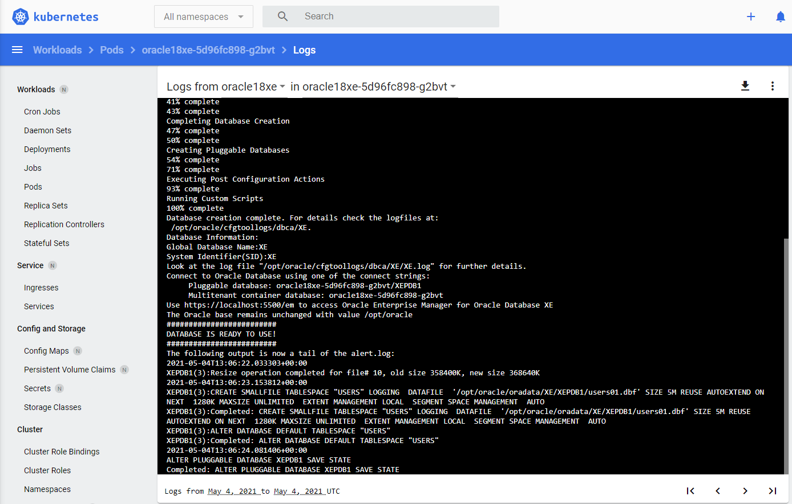
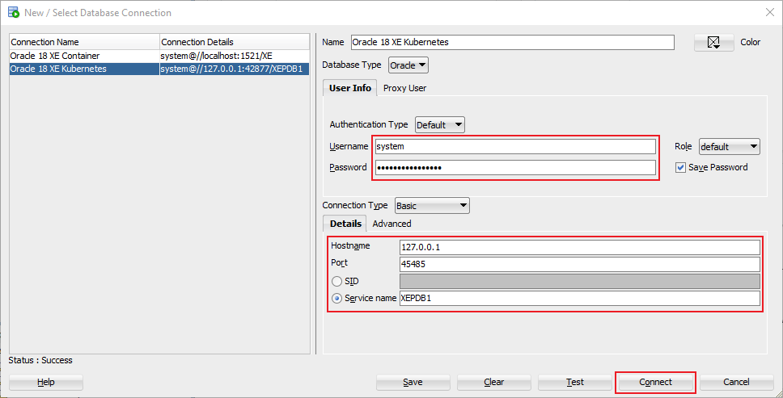
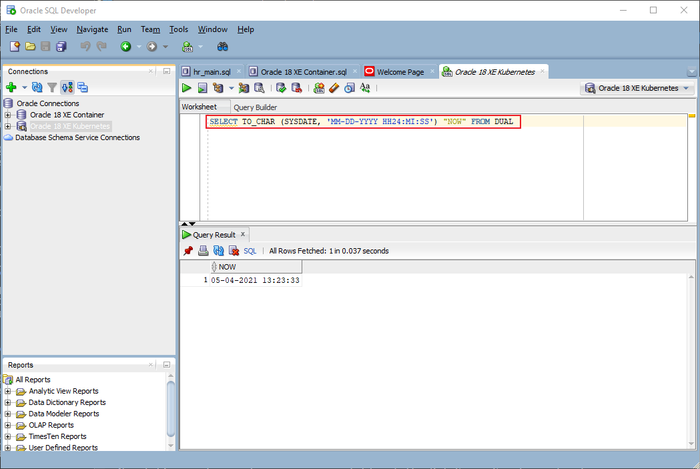

# GraalVM Native Image with Oracle Database XE

### Overview

Many Java (and database) developers are interested in GraalVM's native image capabilities, specifically how it may contribute to better performance of database applications.  Until recently, the Oracle JDBC drivers wouldn't allow for building native images. That issue has been addressed as the new DB21c JDBC drivers have been instrumented with GraalVM configuration files in METAINF/native-image directory. 

In addition to instrumenting the driver, the JDBC developer team has been actively working with the Helidon, Micronaut, and Quarkus teams to integrate the driver and companion jars with their GraalVM native images.

So, after viewing a recent video from Oleg Šelajev (see credits), it motivated me to duplicate the application and walk through the process of using the new Oracle JDBC drivers with an Oracle Database container for testing.

We'll utilize an Oracle Database 18c XE instance running in a container and we'll create and run the same container in a Kubernetes environment.

### Credits
The contents of this tutorial is based on a video originally recorded by **Oleg Šelajev** (see [link](https://www.youtube.com/watch?v=QP83j_Q0CjE&list=PLirn7Sv6CJgGEBn0dVaaNojhi_4T3l2PF&index=2)) and a tutorial by **Ron Ekins** (see [link](https://ronekins.com/2020/06/19/getting-started-with-kubernetes-and-oracle-18c-express-edition-xe/)).


### Build an Oracle Database 18c XE Container

To begin, create the following directories on your local filesystem:

- `/home/<username>/oradata`
  - contains database and required database configuration files and preserves data and configuration files on the local filesystem in the event the container is deleted
- `/home/<username>/scripts/setup`
  - contains SQL scripts that are executed after the database creation has completed
- `/home/<username>/scripts/startup`
  - contains SQL scripts that are executed when the container starts

The directories must be writable by user `UID 54321`, which is the Oracle user within the container. With root access, change the ownership of the directories:

```
$ chown 54321:54321 /home/<username>/oradata
$ chown 54321:54321 /home/<username>/scripts/setup
$ chown 54321:54321 /home/<username>/scripts/startup
```
Clone the Oracle container image repository:
```
$ git clone https://github.com/oracle/docker-images.git
```
Change to the directory containing the Oracle Database container files:
```
$ cd docker-images/OracleDatabase/SingleInstance/dockerfiles
```
Build the database image:
```
$ ./buildDockerImage.sh -v 18.4.0 -x
```
Check that the image was created:
```
$ docker images
REPOSITORY         TAG          IMAGE ID       CREATED         SIZE
oracle/database    18.4.0-xe    827aba9c0902   4 days ago      6.03GB
```
Run the container:
```
$ docker run --rm --name myexdb-1 \
-p 1521:1521 -p 5500:5500 \
-e ORACLE_PWD=mysecurepassword \
-v /home/<username>/oradata:/opt/oracle/oradata \
-v /home/<username>/scripts/setup:/opt/oracle/scripts/setup \
-v /home/<username>/scripts/startup:/opt/oracle/scripts/startup \
oracle/database:18.4.0-xe

The Oracle base remains unchanged with value /opt/oracle
#########################
DATABASE IS READY TO USE!
#########################
The following output is now a tail of the alert.log:
2021-05-03T16:34:55.661012+00:00
QPI: opatch file present, opatch
QPI: qopiprep.bat file present
2021-05-03T16:34:55.849888+00:00
XEPDB1(3):Opening pdb with Resource Manager plan: DEFAULT_PLAN
Pluggable database XEPDB1 opened read write
Starting background process CJQ0
2021-05-03T16:34:55.974901+00:00
CJQ0 started with pid=41, OS id=319
Completed: ALTER DATABASE OPEN
2021-05-03T16:34:56.785318+00:00
Shared IO Pool defaulting to 48MB. Trying to get it from Buffer Cache for process 94.
===========================================================
Dumping current patch information
===========================================================
No patches have been applied
===========================================================

```

Check to confirm it's running:
```
$ docker ps
CONTAINER ID   IMAGE                        COMMAND                  CREATED           STATUS     PORTS                                                            NAMES
cd58d5a0f3a1   oracle/database:18.4.0-xe    "/bin/sh -c 'exec $O…"   48 minutes ago   Up 48 minutes (healthy)   0.0.0.0:1521->1521/tcp, 0.0.0.0:5500->5500/tcp     myexdb-1

```
Install SQL*PLUS client (see [link](https://www.oracle.com/database/technologies/instant-client/linux-x86-64-downloads.html)) and connect to the running database:
```
$ sqlplus system/mysecurepassword@localhost:1521/XE

SQL*Plus: Release 21.0.0.0.0 - Production on Mon May 3 14:10:03 2021
Version 21.1.0.0.0

Copyright (c) 1982, 2020, Oracle.  All rights reserved.

Last Successful login time: Mon May 03 2021 13:33:06 -04:00

Connected to:
Oracle Database 18c Express Edition Release 18.0.0.0.0 - Production
Version 18.4.0.0.0

SQL> SELECT TO_CHAR (SYSDATE, 'MM-DD-YYYY HH24:MI:SS') "NOW" FROM DUAL;

NOW
-------------------
05-03-2021 18:10:35

SQL> exit
Disconnected from Oracle Database 18c Express Edition Release 18.0.0.0.0 - Production
Version 18.4.0.0.0
```

Congratulations, you now have an Oracle Database 18c XE container running!


### Build and Compile the Application

First, clone the following repository:
```
$ git clone https://github.com/swseighman/GraalVM-Native-Image-Oracle-Database.git
```

```
$ cd GraalVM-Native-Image-Oracle-Database
```

Compile the application:

```
$ javac -cp .:/ojdbc11-21.1.0.0.jar DataSourceSample.java
```
***NOTE**: If you need a different version of the Oracle JDBC drivers, you can download it [here](https://www.oracle.com/database/technologies/maven-central-guide.html).*

Run the application:
```
$ java -cp .:/ojdbc11-21.1.0.0.jar DataSourceSample
Driver Name: Oracle JDBC driver
Driver Version: 21.1.0.0.0
Default Row Prefetch Value is: 20
Database Username is: SYSTEM

'SELECT * FROM DUAL' returned: X
```
Let's perform a query:
```
$ java -cp .:/ojdbc11-21.1.0.0.jar DataSourceSample "SELECT TO_CHAR (SYSDATE, 'MM-DD-YYYY HH24:MI:SS') \"NOW\" FROM DUAL"
```
For a simple performance test, we'll time how long it takes to connect to the database and perform the same query:
```
$ time java -cp .:/ojdbc11-21.1.0.0.jar DataSourceSample "SELECT TO_CHAR (SYSDATE, 'MM-DD-YYYY HH24:MI:SS') \"NOW\" FROM DUAL"
Driver Name: Oracle JDBC driver
Driver Version: 21.1.0.0.0
Default Row Prefetch Value is: 20
Database Username is: SYSTEM

'SELECT TO_CHAR (SYSDATE, 'MM-DD-YYYY HH24:MI:SS') "NOW" FROM DUAL' returned: 05-03-2021 17:19:16

real    0m0.947s
user    0m1.324s
sys     0m0.118s

```
As you can see, it takes **947ms** to complete the query *(your actual time may vary)*.

Now let's create a native image executable of the DataSourceSample application:
```
$ native-image -cp .:/ojdbc11-21.1.0.0.jar DataSourceSample
[datasourcesample:46780]    classlist:   1,119.72 ms,  0.96 GB
[datasourcesample:46780]        (cap):     698.05 ms,  0.96 GB
WARNING: Method java.sql.SQLXML.<init>() not found.
[datasourcesample:46780]        setup:   2,703.47 ms,  0.96 GB
[datasourcesample:46780]     (clinit):     650.37 ms,  3.22 GB
[datasourcesample:46780]   (typeflow):  11,076.31 ms,  3.22 GB
[datasourcesample:46780]    (objects):  21,435.26 ms,  3.22 GB
[datasourcesample:46780]   (features):   1,643.29 ms,  3.22 GB
[datasourcesample:46780]     analysis:  35,755.73 ms,  3.22 GB
[datasourcesample:46780]     universe:   1,143.49 ms,  3.22 GB
[datasourcesample:46780]      (parse):   4,728.68 ms,  5.34 GB
[datasourcesample:46780]     (inline):   2,556.02 ms,  5.54 GB
[datasourcesample:46780]    (compile):  39,862.82 ms,  6.43 GB
[datasourcesample:46780]      compile:  50,517.38 ms,  6.43 GB
[datasourcesample:46780]        image:   3,942.94 ms,  6.45 GB
[datasourcesample:46780]        write:     593.37 ms,  6.45 GB
[datasourcesample:46780]      [total]:  95,996.08 ms,  6.45 GB
```

```
$ ./datasourcesample
Driver Name: Oracle JDBC driver
Driver Version: 21.1.0.0.0
Default Row Prefetch Value is: 20
Database Username is: SYSTEM

'SELECT * FROM DUAL' returned: X
```
And we'll run the same performance test using the native image executable:
```
 $ time ./datasourcesample "SELECT TO_CHAR (SYSDATE, 'MM-DD-YYYY HH24:MI:SS') \"NOW\" FROM DUAL"
Driver Name: Oracle JDBC driver
Driver Version: 21.1.0.0.0
Default Row Prefetch Value is: 20
Database Username is: SYSTEM

'SELECT TO_CHAR (SYSDATE, 'MM-DD-YYY HH24:MI:SS') "NOW" FROM DUAL' returned: 05-03-021 15:48:04

real    0m0.040s
user    0m0.016s
sys     0m0.000s

```
Impressive, it takes only **40ms** using the native image executable!

### Using Oracle Database 18c XE with Kubernetes

#### Kubernetes Configuration and Setup

First, we'll need to install `minikube`, follow the instructions here: 
https://minikube.sigs.k8s.io/docs/start/

Next, install `kubectl`, see the instructions here:
https://kubernetes.io/docs/tasks/tools/install-kubectl/


```
$ minikube version
minikube version: v1.19.0
commit: 15cede53bdc5fe242228853e737333b09d4336b5
```

```
$ minikube config set memory 8192
$ minikube config set cpus 4
$ minikube config set driver docker
$ minikube config set kubernetes-version v1.20.2
```
 
```
 $ minikube config view
- driver: docker
- kubernetes-version: v1.20.2
- memory: 8192
- cpus: 4
```

```
$ minikube addons enable metrics-server
▪ Using image k8s.gcr.io/metrics-server/metrics-server:v0.4.2
🌟  The 'metrics-server' addon is enabled
```

```
$ minikube start
😄  minikube v1.19.0
✨  Using the docker driver based on existing profile
👍  Starting control plane node minikube in cluster minikube
🔄  Restarting existing docker container for "minikube" ...
🐳  Preparing Kubernetes v1.20.2 on Docker 20.10.5 ...
🔎  Verifying Kubernetes components...
    ▪ Using image kubernetesui/dashboard:v2.1.0
    ▪ Using image kubernetesui/metrics-scraper:v1.0.4
    ▪ Using image k8s.gcr.io/metrics-server/metrics-server:v0.4.2
    ▪ Using image gcr.io/k8s-minikube/storage-provisioner:v5
🌟  Enabled addons: storage-provisioner, default-storageclass, metrics-server, dashboard
🏄  Done! kubectl is now configured to use "minikube" cluster and "default" namespace by default
```

Check the status of `minikube`:
```
$ minikube status
minikube
type: Control Plane
host: Running
kubelet: Running
apiserver: Running
kubeconfig: Configured
```

Open the dashboard to view the current state of the kubernetes cluster:
```
$ minikube dashboard
🔌  Enabling dashboard ...
    ▪ Using image kubernetesui/dashboard:v2.1.0
    ▪ Using image kubernetesui/metrics-scraper:v1.0.4
🤔  Verifying dashboard health ...
🚀  Launching proxy ...
🤔  Verifying proxy health ...
🎉  Opening http://127.0.0.1:36659/api/v1/namespaces/kubernetes-dashboard/services/http:kubernetes-dashboard:/proxy/ in your default browser...
👉  http://127.0.0.1:36659/api/v1/namespaces/kubernetes-dashboard/services/http:kubernetes-dashboard:/proxy/
```
***CTRL-Click*** the dashboard URL above to open the dashboard.


Great, our kubernetes environment is up and running.

#### Build an Oracle Database XE Container in Kubernetes
```
$ git clone https://github.com/oracle/docker-images.git
$ cd docker-images/OracleDatabase/SingleInstance/dockerfiles
$ eval $(minikube docker-env)
$ ./buildContainerImage.sh -v 18.4.0 -x
```

***NOTE**: The image build may take 5-8 minutes.*

You can check the build logs from the `minikube dashboard`.

Click on `Pods`:



Then choose the Oracle Database container:



Next, click on the `Logs` icon:






Now check to confirm the container image was created in the kubernetes environment:
```
$ minikube ssh
docker@minikube:~$ docker images | grep oracle
oracle/database         18.4.0-xe   1e981e6c95ca   About a minute ago   5.89GB
oraclelinux             7-slim      f9b86bc68e2e   3 days ago           132MB
```
Create a namespace:
```
$ kubectl create namespace oracle-db
namespace/oracle-db created
```
Show the namespace:
```
$ kubectl get namespace oracle-db
```
Create a ConfigMap:
```
$ kubectl create configmap oradb --from-env-file=oracle.properties -n oracle-db
configmap/oradb created
```
Create the deployment and service:
```
$ kubectl apply -f oradb18xe.yaml -n oracle-db
deployment.apps/oracle18xe created
service/oracle18xe created
```
Show the deployment:
```
$ kubectl get deployments -n oracle-db
NAME         READY   UP-TO-DATE   AVAILABLE   AGE
oracle18xe   1/1     1            1           15s
```
Show the running pods in the namespace:
```
$ kubectl get pods -n oracle-db
NAME                         READY   STATUS    RESTARTS   AGE
oracle18xe-5d96fc898-g2bvt   1/1     Running   0          96s
```
There are various other commands to describe everything in detail:
```
$ kubectl describe deployments -n oracle-db
$ kubectl describe pods -n oracle-db
$ kubectl describe secrets -n oracle-db
$ kubectl describe services -n oracle-db
```
Show the running services:
```
$ kubectl get services -n oracle-db
NAME         TYPE       CLUSTER-IP      EXTERNAL-IP   PORT(S)                         AGE
oracle18xe   NodePort   10.107.53.199   <none>        1521:31918/TCP,5500:32380/TCP   11m
```
Display the service ports (and IP):
```
$ minikube service oracle18xe -n oracle-db --url
🏃  Starting tunnel for service oracle18xe.
|-----------|------------|-------------|------------------------|
| NAMESPACE |    NAME    | TARGET PORT |          URL           |
|-----------|------------|-------------|------------------------|
| oracle-db | oracle18xe |             | http://127.0.0.1:45485 |
|           |            |             | http://127.0.0.1:39599 |
|-----------|------------|-------------|------------------------|
http://127.0.0.1:45485  <--- Use this URL in the command below
http://127.0.0.1:39599
❗  Because you are using a Docker driver on linux, the terminal needs to be open to run it.
```

Use SQL*PLUS to access the running database (use the service IP/port above):
```
 $ sqlplus system/mysecurepassword@127.0.0.1:45485/XEPDB1

SQL*Plus: Release 21.0.0.0.0 - Production on Tue May 4 09:17:32 2021
Version 21.1.0.0.0

Copyright (c) 1982, 2020, Oracle.  All rights reserved.


Connected to:
Oracle Database 18c Express Edition Release 18.0.0.0.0 - Production
Version 18.4.0.0.0

SQL>
```

### Using the DataSourceSample Application with Kubernetes
Edit the `DataSourceSample.java` file and uncomment the kubernetes lines, then comment out the container lines. Make certain to replace the port within the `DB_URL` line with the one displayed in the service above (in this case, **45485** )
```
// For Kubernetes version
   final static String DB_URL= "jdbc:oracle:thin:@127.0.0.1:45485/XEPDB1";
   final static String DB_USER = "system";
   final static String DB_PASSWORD = "mysecurepassword";

  // For Container version
  // final static String DB_URL= "jdbc:oracle:thin:@localhost:1521/XE";
  // final static String DB_USER = "system";
  // final static String DB_PASSWORD = "mysecurepassword";
```
After saving the changes, compile the application once again:

```
$ javac -cp .:/ojdbc11-21.1.0.0.jar DataSourceSample.java
```

Run the application:
```
$ java -cp .:/ojdbc11-21.1.0.0.jar DataSourceSample
Driver Name: Oracle JDBC driver
Driver Version: 21.1.0.0.0
Default Row Prefetch Value is: 20
Database Username is: SYSTEM

'SELECT * FROM DUAL' returned: X
```
Of course, you can create a native image and run that version too:
```
$ native-image -cp .:/ojdbc11-21.1.0.0.jar DataSourceSample
```
```
$ ./datasourcesample
Driver Name: Oracle JDBC driver
Driver Version: 21.1.0.0.0
Default Row Prefetch Value is: 20
Database Username is: SYSTEM

'SELECT * FROM DUAL' returned: X
```
You can also use other tools like SQL Developer to access the database:






To stop the kubernetes cluster, execute the following command:
```
$ minikube stop
✋  Stopping node "minikube"  ...
🛑  Powering off "minikube" via SSH ...
🛑  1 nodes stopped.
```

### Summary

We explored how the new Oracle JDBC drivers can be used to create native image executables and (via our simple example) demonstrated impressive performance improvements. Of course, having a Oracle Database container helps with testing and the added value of deploying in a kubernetes cluster further expands your testing environment.